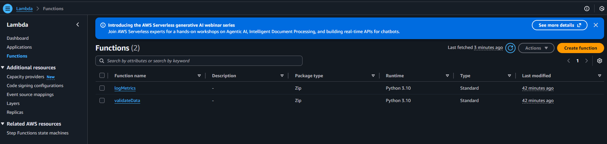
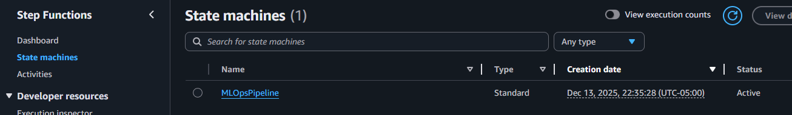
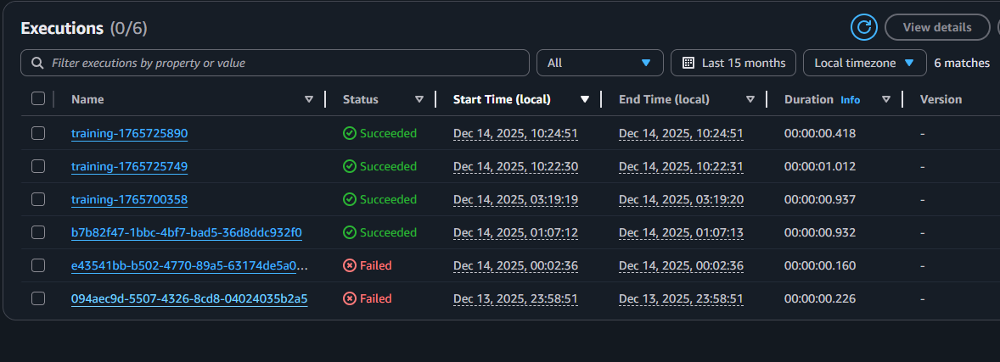

# MLOps Train Automation

Це копія проєкту https://gitlab.com/mlops2631050/mlops-train-automation.git, який демонструє автоматизоване тренування моделей через AWS Step Functions, Lambda і GitLab CI.

Структура проєкту

    mlops-train-automation/
    ├── terraform/
    │   ├── main.tf
    │   ├── variables.tf
    │   ├── lambda/
    │   │   ├── validate.py
    │   │   ├── log_metrics.py
    │   │   ├── validate.zip
    │   │   └── log_metrics.zip
    ├── .gitlab-ci.yml
    └── README.md

## 1️⃣ Lambda-функції
- validate.py – імітує валідацію вхідних даних:

        def handler(event, context):
            print("✅ Validating input data...")
            return {"status": "valid"}

- log_metrics.py – імітує логування метрик:

        def handler(event, context):
            print("📈 Logging metrics to MLflow...")
            return {"status": "logged"}

##№ Архівація скриптів перед запуском Terraform:

        cd terraform/lambda
        zip validate.zip validate.py
        zip log_metrics.zip log_metrics.py

## 2️⃣ Terraform

Ресурси створюються через main.tf:

- IAM ролі для Lambda та Step Function
- Lambda-функції (validateData, logMetrics)
- Step Function (MLOpsPipeline) з послідовним виконанням Lambda

Деплой
        terraform init
        terraform apply

Перевірка створених ресурсів:

- AWS Console → Lambda → перевірка функцій

- AWS Console → Step Functions → перевірка pipeline

## 3️⃣ GitLab CI

.gitlab-ci.yml запускає Step Function при push:

    train-model:
    stage: train
    image: amazon/aws-cli:2.15.0
    script:
        - aws stepfunctions start-execution \
            --state-machine-arn $STATE_MACHINE_ARN \
            --name "train-$(date +%s)" \
            --input '{"source":"gitlab-ci","commit":"'$CI_COMMIT_SHORT_SHA'"}'

### Змінні GitLab CI
Settings → CI/CD → Variables:

- AWS_ACCESS_KEY_ID	    <IAM User Key>
- AWS_SECRET_ACCESS_KEY	<IAM User Secret>
- AWS_DEFAULT_REGION	    us-east-1
- STATE_MACHINE_ARN	    ARN Step Function

## 4️⃣ Тестування

### Вручну через AWS Console:

Step Functions → MLOpsPipeline → Start execution → JSON: 

    {"source":"manual-test"}

Execution history: ValidateData → LogMetrics

### Через GitLab CI:
Push у main → pipeline запускає job train-model
AWS Step Function виконує Lambda автоматично

Приклад JSON, що передається через -input

        {
        "source": "gitlab-ci",
        "commit": "a1b2c3d"
        }

