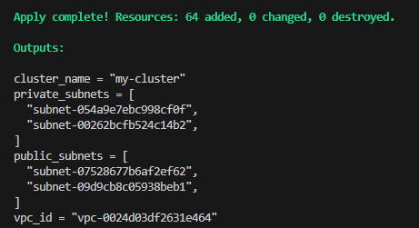
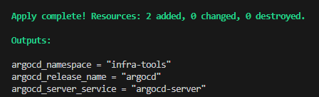
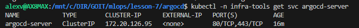
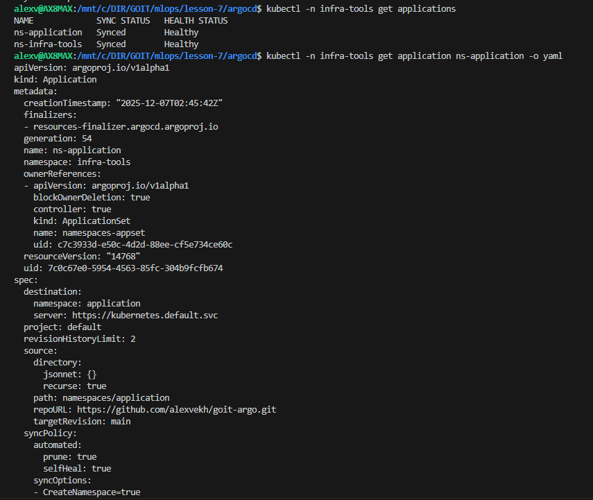
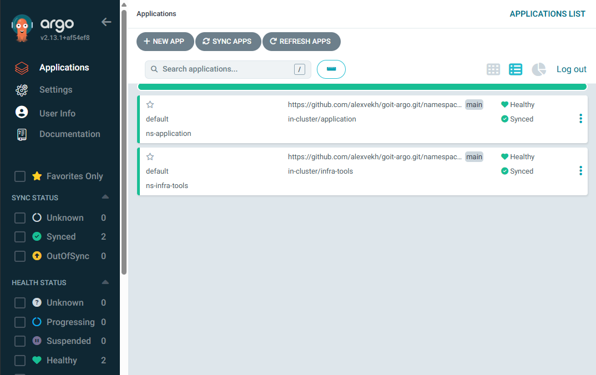
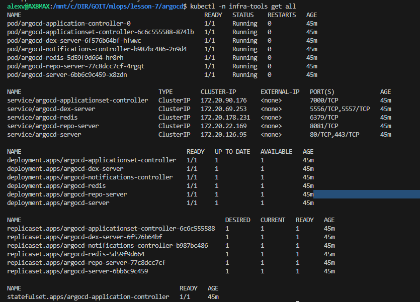

# Інфраструктура: Terraform + ArgoCD

Цей проєкт автоматизує створення Kubernetes-інфраструктури за допомогою Terraform, а також налаштовує ArgoCD для керування застосунками. 

ArgoCD налаштовано на автоматичний деплой застосунків із Git-репозиторію — реалізовано повноцінний GitOps-підхід: кластер завжди синхронізовано з конфігурацією в Git.

## 📦 Project Structure

        /
        ├── s3/
        │   └── main.tf
        ├── eks-vpc-cluster/
        │   ├── main.tf
        │   ├── variables.tf
        │   ├── outputs.tf
        │   ├── terraform.tf
        │   ├── backend.tf
        │   ├── vpc/
        │   │   ├── main.tf
        │   │   ├── variables.tf
        │   │   ├── outputs.tf
        │   │   ├── terraform.tf
        │   │   └── backend.tf
        │   └── eks/
        │       ├── main.tf
        │       ├── variables.tf
        │       ├── outputs.tf
        │       ├── terraform.tf
        │       └── backend.tf
        ├── argocd/
        │   ├── main.tf
        │   ├── variables.tf
        │   ├── outputs.tf
        │   ├── terraform.tf
        │   └── backend.tf
        └── README.md

## 🚀 Requirements

Before you start, install:
 1. Terraform - https://developer.hashicorp.com/terraform/downloads
 2. AWS CLI - https://docs.aws.amazon.com/cli/latest/userguide/install-cliv2.html
 3. Configure AWS credentials:
        aws configure

## 📦 Як запустити Terraform?

### 1. Сворити бакет

        cd s3
        terraform init
        terraform plan
        terraform aply

- Буде створено amazon s3 backet для зберігання terraform.tfstate - стану всієї інфраструктури.       

### 2. Запустити clucter
        cd ../eks-vbc-cluster
        terraform init
        terraform plan
        terraform aply

- Після завершення Terraform створить, VPC, приватні та публічні сабнети, Internet Gateway / NAT, EKS кластер, тобто готовий Kubernetes-кластер.

### 3. Встановити ArgoCD
        cd ../argocd
        terraform init
        terraform plan
        terraform aply

- В результаті Terraform створить namespace infra-tools, встановить ArgoCD через Helm chart.
 

### 4. Створити ApplicationSet

- Розкоментувати код в argocd/main.tf (рядки 25 і далі)
        
        resource "kubernetes_manifest" "namespaces_appset" {
           ...
        }

- та втановити знову 

        terraform init
        terraform plan
        terraform aply

- Тепер, коли CRD уже встановлені, Terraform успішно створить ApplicationSet

## 🎯 Як перевірити, що ArgoCD працює?

Перевірити pod-и:

        aws eks update-kubeconfig --name my-cluster --region us-east-1
        kubectl -n infra-tools get pods
        kubectl get nodes

усі у статусі Running.

Перевірити сервіс:

        kubectl -n infra-tools get svc argocd-server

Перевірити application.yaml, який створено автоматично з шаблону

        kubectl -n infra-tools get applications
        kubectl -n infra-tools get application ns-application -o yaml

## 🌐 Як відкрити UI ArgoCD?

Отримати початковий пароль:

        kubectl -n infra-tools get secret argocd-initial-admin-secret \
        -o jsonpath="{.data.password}" | base64 -d

Запустити Port-forward:

        kubectl port-forward svc/argocd-server -n infra-tools 8080:80

Відкрити браузер:

        http://localhost:8080

🔑 Логін:

Username: admin
Password: <отриманий вище пароль>

## 🎯 Як перевірити, що деплой ApplicationSet працює?

Переглянути всі застосунки ArgoCD:

        kubectl -n infra-tools get applications
        kubectl -n infra-tools get applicationsets
        kubectl -n infra-tools get application <ім’я> -o yaml

Перевірити стан конкретного застосунку:

        kubectl -n infra-tools get application <app-name> -o wide

Стани:
- Synced — все застосовано
- Healthy — усі ресурси у нормі
- OutOfSync — зміни в Git, але не в кластері

Перевірити створені Kubernetes-ресурси:

        kubectl -n <namespace> get all
        kubectl -n infra-tools get all

## 🧹 Як видалити Infrastructure
        
        terraform destroy

## 📁 Посилання на Git-репозиторій

Проєкт налаштовано на деплой із Git-репозиторію.
👉 https://github.com/alexvekh/goit-argo.git

        goit-argo
        ├── namespaces
        │  ├── application
        │  │  ├── nginx.yaml
        │  │  └── ns.yaml
        │  └── infra-tools
        │    └── ns.yaml
        └── README.md

## Можливі проблеми с шляхи вирішення.
При повторному встановленні інфраструктури:

        Error: Plugin error
        The plugin returned an unexpected error from plugin.(*GRPCProvider).UpgradeResourceState: rpc error: code = Unknown desc = failed to determine resource GVK: no matches for kind "ApplicationSet" in group "argoproj.io"

Це може з`явитися якщо:
- код в argocd/main.tf (рядки 25 і далі) не закоментовано
- після першого встановлення залишився в бакеті файл kubernetes_manifest.namespaces_appset і terraform зчитує стан звідти

Потрібно видалити файл стану

        terraform state list
        
Знайди рідок: kubernetes_manifest.namespaces_appset

        terraform state rm kubernetes_manifest.namespaces_appset
        terraform init
        terraform apply